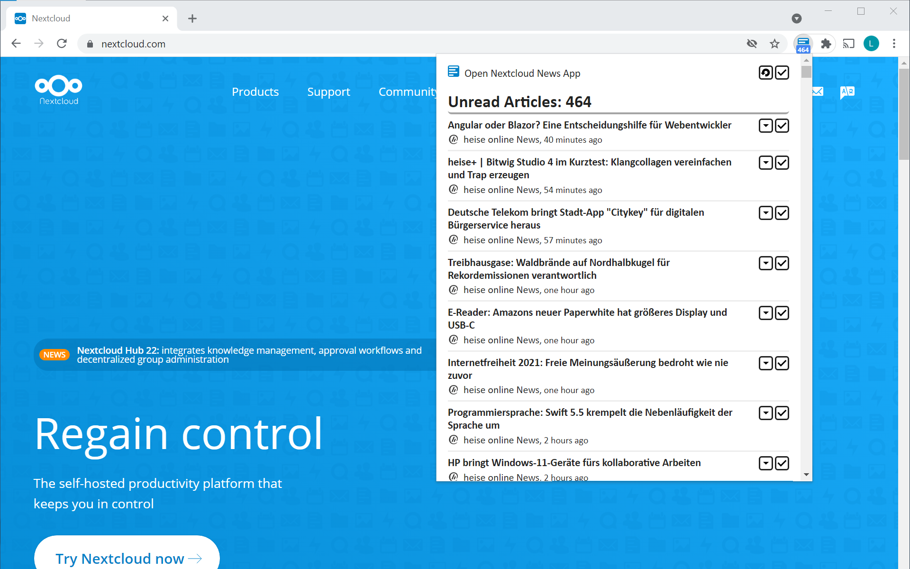

# Nextcloud News Webextension
## Webextension for Nextcloud News

A simple Google Chrome extension that displays unread articles from the [Nextcloud News App](https://github.com/nextcloud/news).

## Features
- Connects with a Nextcloud insctance running the [Nextcloud News App](https://github.com/nextcloud/news)
- Displays unread articles 
- Open links to articles
- Mark articles as read

## Installation
 

Install this extension either via the [Chrome Web Store](https://chrome.google.com/webstore/detail/nextcloud-news-checker/ehefnhcojbpkophibijadabacoakondh), the [Firefox Add-On Store](https://addons.mozilla.org/de/firefox/addon/nextcloud-news-webextension/) or download the extension files from the [releases page](https://github.com/lukasleist/news-chrome-notifier/releases/).

## Known Issues

- **Issue:** Sometimes the Nextcloud authentication fails with a message indicating that the *login failed*.
- **Workaround:** Logout from Nextcloud in the current browser window and try again.

## Screenshots

